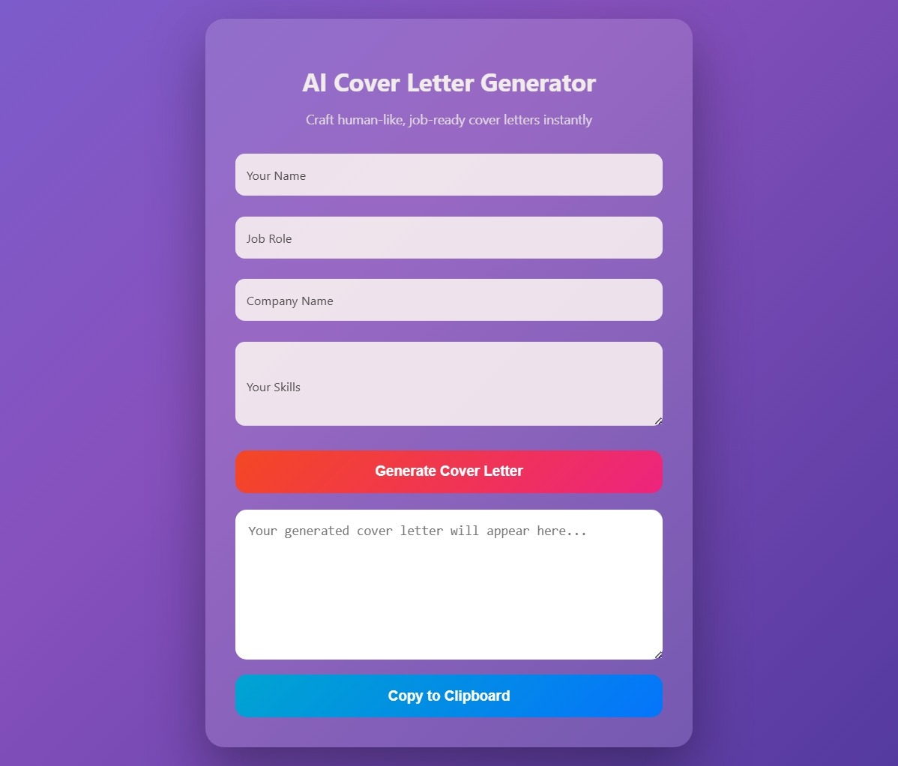

# AI Cover Letter Generator 

A web-based AI tool that generates professional cover letters based on user input.

## Features
- Clean & responsive UI
- AI-powered cover letter generation
- Copy to clipboard
- Secure backend API handling

## Tech Stack
- HTML, CSS, JavaScript
- Node.js, Express
- AI API (Gemini / OpenAI)

## How to Run
1. Clone the repo
2. Install dependencies  
   `npm install`
3. Create `.env` file and add your API key
4. Run server  
   `npm start`

## YouTube Link
https://youtu.be/mIp2Q_J78V4?si=89cNgEKWEDoKmoL7
##  Home Page

